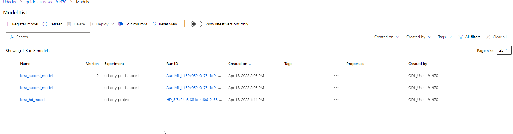

# Optimizing an ML Pipeline in Azure

## Overview
This project is part of the Udacity Azure ML Nanodegree.
In this project, we build and optimize an Azure ML pipeline using the Python SDK and a provided Scikit-learn model.
This model is then compared to an Azure AutoML run.

## Useful Resources
- [ScriptRunConfig Class](https://docs.microsoft.com/en-us/python/api/azureml-core/azureml.core.scriptrunconfig?view=azure-ml-py)
- [Configure and submit training runs](https://docs.microsoft.com/en-us/azure/machine-learning/how-to-set-up-training-targets)
- [HyperDriveConfig Class](https://docs.microsoft.com/en-us/python/api/azureml-train-core/azureml.train.hyperdrive.hyperdriveconfig?view=azure-ml-py)
- [How to tune hyperparamters](https://docs.microsoft.com/en-us/azure/machine-learning/how-to-tune-hyperparameters)


## Summary

The [UCI Dataset](https://archive.ics.uci.edu/ml/datasets/bank+marketing) is concerned with the prediction of the success rate of a telemarketing campain of a portuguese bank.

A detailed list and more information on the dataset can be found here [Link to website of Bank Marketing Data Set](https://archive.ics.uci.edu/ml/datasets/bank+marketing) Below a copy on the data explaination is displayed

The dataset contains the following 20 features
Backround info
- age: Age of the customer numberic
- job: Job title categorical
- marital: marital status categorical
- education: What kind of education categorical
- default: is person in default categorical
- housing: wheather a housing load categorical
- loan: normal loan
Contact information
- contact: cell or telephone categorical
- month: month of year categorical
- day_of_week: last contact day
- duration: last contact duration. The maintainer warn about this variable influence on the target y
Misc info
- campaign: number of contacts performed during this campaign and for this client 
- pdays: number of days that passed by after the client was last contacted from a previous campaign (numeric; 999 means client was not previously contacted)
- previous: number of contacts performed before this campaign and for this client (numeric)
- poutcome: outcome of the previous marketing campaign (categorical: 'failure','nonexistent','success')
socials
- emp.var.rate: employment variation rate - quarterly indicator (numeric)
- cons.price.idx: consumer price index - monthly indicator (numeric)
- cons.conf.idx: consumer confidence index - monthly indicator (numeric)
- euribor3m: euribor 3 month rate - daily indicator (numeric)
- nr.employed: number of employees - quarterly indicator (numeric)

The success of the telemarketing call can be found in the y column in the dataset.


Using the AutoML feature of Azure the best model was a VotingEnsemble w/ an accuracy 91.77%.


## Scikit-learn Pipeline

First we modifed a script for training a Logistic Regression regression model, which can be parameterzied with the maximum iteration steps and the regularization parameter. This gives us the opporunity to use Azure HyperDrive to find the best combination of $C$ and *max_iter*.

A detailed list and more information on the dataset can be found here [Link to website of Bank Marketing Data Set](https://archive.ics.uci.edu/ml/datasets/bank+marketing) 

Below a copy on the data explaination is displayed

The dataset contains the following 20 features
Backround info
- age: Age of the customer numberic
- job: Job title categorical
- marital: marital status categorical
- education: What kind of education categorical
- default: is person in default categorical
- housing: wheather a housing load categorical
- loan: normal loan
Contact information
- contact: cell or telephone categorical
- month: month of year categorical
- day_of_week: last contact day
- duration: last contact duration. The maintainer warn about this variable influence on the target y
Misc info
- campaign: number of contacts performed during this campaign and for this client 
- pdays: number of days that passed by after the client was last contacted from a previous campaign (numeric; 999 means client was not previously contacted)
- previous: number of contacts performed before this campaign and for this client (numeric)
- poutcome: outcome of the previous marketing campaign (categorical: 'failure','nonexistent','success')
socials
- emp.var.rate: employment variation rate - quarterly indicator (numeric)
- cons.price.idx: consumer price index - monthly indicator (numeric)
- cons.conf.idx: consumer confidence index - monthly indicator (numeric)
- euribor3m: euribor 3 month rate - daily indicator (numeric)
- nr.employed: number of employees - quarterly indicator (numeric)


All these features will be used in the logistic regression in order to predict the outcome y of the success of the marketing campain on a certain customer. This knowlegde will be usefull in the future only calling customers w/ a high change of success predicted by the model. Since there are 20 features the regularization parameter is very important. It controls that all these features are "balanced" and the model finds a the abstacted information hidden in the data.

In order to run this experiment, we created a cluster w/ 4 VM of type Standard_D2_V2 within the script. After the cluster was available we configured hyperdrive to use this cluster and the train.py script. In order to fully use Hyperdrive the parameter sampler was operating on a uniform range from 0.01 up to 10 and given the choice between 64 and 512 iterations and a bandit stopping policy was given. (See questions below)

The run took around 13 minutes. HyperDrive found the combination of regularization parameter = 1.28 with 512 maximum iteration to perform the best w/ an accuray of 90.89%.

**What are the benefits of the parameter sampler you chose?**
Using the random sampler enables us to quickly sample the configuration space and generate a good estimate w/o running a full grid search and therefore saving computation costs. Since the regulazation $C$ is continous we choose the uniform sampler, while for the maximum iteration parameter the choice sampler helps to find a good parameter.

**What are the benefits of the early stopping policy you chose?**
The bandit policy helps to stop bad performing runs. This saves costs and therefore spends the available compute resources to promising runs. 


## AutoML

AutoML had a timeout of 15minutes in order to find the best model. In this time it was able to check eight different models with accuracies ranging from 73% w/ an Extreme Random Tree model up to 91.77% percent w/ a VotingEnsemble model. Using AutoML the normalization and hyperparameter tuning is done by the AutoML feature.

```
 ITER   PIPELINE                                       DURATION            METRIC      BEST  
    0   MaxAbsScaler LightGBM                          0:00:40             0.9166    0.9166
    1   MaxAbsScaler XGBoostClassifier                 0:00:48             0.9125    0.9166
    2   MaxAbsScaler ExtremeRandomTrees                0:00:38             0.7310    0.9166
    3   SparseNormalizer XGBoostClassifier             0:00:37             0.9145    0.9166
    4   MaxAbsScaler LightGBM                          0:00:29             0.9147    0.9166
    5   MaxAbsScaler LightGBM                          0:00:29             0.8881    0.9166
    6   StandardScalerWrapper XGBoostClassifier        0:00:32             0.9072    0.9166
    7    VotingEnsemble                                0:00:20             0.9177    0.9177
    8    StackEnsemble                                 0:00:31             0.9170    0.9177
```

The VotingEnsemble now takes these models and combines them into a more powerfull one. AzureML implements the VotingEnsemble as a soft model ([seed](https://docs.microsoft.com/de-de/python/api/azureml-train-automl-runtime/azureml.train.automl.runtime.ensemble.votingensemble?view=azure-ml-py)). Therefore each model a weight is assigned

```
ITER   PIPELINE                                       DURATION            METRIC      BEST   WEIGHT 
    0   MaxAbsScaler LightGBM                          0:00:40             0.9166    0.9166  0.4666666666666667
    1   MaxAbsScaler XGBoostClassifier                 0:00:48             0.9125    0.9166  0.06666666666666667
    2   MaxAbsScaler ExtremeRandomTrees                0:00:38             0.7310    0.9166  0.06666666666666667
    3   SparseNormalizer XGBoostClassifier             0:00:37             0.9145    0.9166  0.2
    4   MaxAbsScaler LightGBM                          0:00:29             0.9147    0.9166  0.13333333333333333
    5   MaxAbsScaler LightGBM                          0:00:29             0.8881    0.9166  Not considered
    6   StandardScalerWrapper XGBoostClassifier        0:00:32             0.9072    0.9166  0.06666666666666667
````
and the a prediction class is used, where the highest combined average of all models point to. For more information of the parameters assigned to the model please refer to the output

```
estimators=[
    ('0', Pipeline(memory=None, steps=[('maxabsscaler', MaxAbsScaler(copy=True)), ('lightgbmclassifier', LightGBMClassifier(min_data_in_leaf=20, n_jobs=1, problem_info=ProblemInfo(gpu_training_param_dict={'processing_unit_type': 'cpu'}), random_state=None))], verbose=False)), 
    ('4', Pipeline(memory=None, steps=[('maxabsscaler', MaxAbsScaler(copy=True)), ('lightgbmclassifier', LightGBMClassifier(boosting_type='gbdt', colsample_bytree=0.6933333333333332, learning_rate=0.09473736842105263, max_bin=110, max_depth=8, min_child_weight=6, min_data_in_leaf=0.003457931034482759, min_split_gain=1, n_estimators=25, n_jobs=1, num_leaves=227, problem_info=ProblemInfo(gpu_training_param_dict={'processing_unit_type': 'cpu'}), random_state=None, reg_alpha=0.9473684210526315, reg_lambda=0.42105263157894735, subsample=0.49526315789473685))], verbose=False)), 
    ('3', Pipeline(memory=None, steps=[('sparsenormalizer', Normalizer(copy=True, norm='l2')), ('xgboostclassifier', XGBoostClassifier(booster='gbtree', colsample_bytree=0.7, eta=0.01, gamma=0.01, max_depth=7, max_leaves=31, n_estimators=10, n_jobs=1, objective='reg:logistic', problem_info=ProblemInfo(gpu_training_param_dict={'processing_unit_type': 'cpu'}), random_state=0, reg_alpha=2.1875, reg_lambda=1.0416666666666667, subsample=1, tree_method='auto'))], verbose=False)), 
    ('1', Pipeline(memory=None, steps=[('maxabsscaler', MaxAbsScaler(copy=True)), ('xgboostclassifier', XGBoostClassifier(n_jobs=1, problem_info=ProblemInfo(gpu_training_param_dict={'processing_unit_type': 'cpu'}), random_state=0, tree_method='auto'))], verbose=False)), 
    ('6', Pipeline(memory=None, steps=[('standardscalerwrapper', StandardScalerWrapper(copy=True, with_mean=False, with_std=False)), ('xgboostclassifier', XGBoostClassifier(booster='gbtree', colsample_bytree=0.5, eta=0.3, gamma=0, max_depth=10, max_leaves=255, n_estimators=10, n_jobs=1, objective='reg:logistic', problem_info=ProblemInfo(gpu_training_param_dict={'processing_unit_type': 'cpu'}), random_state=0, reg_alpha=0, reg_lambda=0.10416666666666667, subsample=0.7, tree_method='auto'))], verbose=False)), 
    ('2', Pipeline(memory=None, steps=[('maxabsscaler', MaxAbsScaler(copy=True)), ('extratreesclassifier', ExtraTreesClassifier(bootstrap=True, ccp_alpha=0.0, class_weight='balanced', criterion='gini', max_depth=None, max_features='sqrt', max_leaf_nodes=None, max_samples=None, min_impurity_decrease=0.0, min_impurity_split=None, min_samples_leaf=0.01, min_samples_split=0.15052631578947367, min_weight_fraction_leaf=0.0, n_estimators=100, n_jobs=1, oob_score=True, random_state=None, verbose=0, warm_start=False))], verbose=False))
]
```

In order to reuse the best model the VotingEnsemble was saved to the workspace model section.



## Pipeline comparison
**Compare the two models and their performance. What are the differences in accuracy? In architecture? If there was a difference, why do you think there was one?**

Both approaches are really effective in generating a good model. With the HyperDrive approach the data scientist is able to quickly generate a model based on his or her instincts. While AutoML is great for letting Azure select the best performing model. AutoML not only checks one model but
a whole list of different models and performs the hyperparameter tuning in one run. 

Therefore with Hyperdrive the data scientist has more control over the model and its hyperparameters but AutoML enables the user to quickly setup a model with comparable accuracy without a lot of investigation into the data.

In this case best performing model w/ hyperdrive was found in around 12 minutes with an accurcy of 90.89%, while AutoML took all 15min and resulted in an accuracy of 91.77%

Since AutoML can choose from many different algorithms it is not surprising that it can check for algorithms, which are better taylored for the problem.


## Future work
**What are some areas of improvement for future experiments? Why might these improvements help the model?**

- Give hyperdrive more computing resources, in order to search a larger grid w/ more *max_iter* and a lager range of *C*.
- Change from random to grid search in the hyperdrive model selection
- AutoML detected *Class balancing detection*. One should take a closer look here and rerun w/ a balenced dataset

